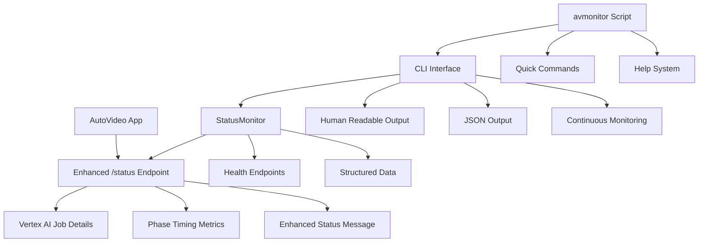

# AutoVideo Monitoring & Management System

## Overview

A comprehensive local monitoring and management interface for the AutoVideo system, designed to evolve from simple status monitoring to a full-featured management platform. This system provides real-time visibility into video generation processes, Vertex AI job status, system health, and will expand to include job control and automation features.

## Creation Timeline

### Initial Problem (2025-05-29)
- **Issue**: Status endpoint only showed static messages during long video generation waits
- **Need**: Real-time visibility into Vertex AI job status, queue times, and system health
- **Goal**: Create local monitoring tools that won't interfere with production deployments

### Phase 1: Enhanced Status Endpoint ✅
**Implemented**: Enhanced the main application's `/status` endpoint with real-time Vertex AI job details

**Key Features Added**:
- `get_vertex_ai_job_details()` function using gcloud CLI for reliable job status
- Enhanced status response with job state, machine type, GPU info, duration tracking
- Error handling and detailed failure information
- Structured data for future API consumption

**Technical Details**:
- Uses `gcloud ai custom-jobs list` with filtering for reliability
- Parses timestamps and calculates queue/run/total durations
- Extracts machine specs, GPU configurations, and error messages
- Provides both human-readable and structured data formats

### Phase 2: Local Monitoring Interface ✅
**Implemented**: Comprehensive local monitoring tools completely isolated from production

**Architecture**:
```
monitor/                 # Main monitoring package (git ignored)
├── __init__.py         # Package initialization  
├── status_monitor.py   # Core monitoring functionality
├── cli.py             # Command-line interface
├── monitor.py         # Main entry point
└── README.md          # Package documentation

local_monitor.py        # Original simple monitor (compatibility)
avmonitor              # Convenience script for quick access
.gitignore             # Updated to ignore all monitoring files
```

## Current Features

### 🎯 Status Monitoring
- **Real-time Status**: Live updates on video generation progress
- **Vertex AI Job Details**: State, machine type, GPU configuration, duration tracking
- **Phase Metrics**: Timing for story, image, voiceover, and video creation phases  
- **Enhanced Display**: Rich console output with emojis and structured information

### 🏥 Health Monitoring
- **Comprehensive Health Checks**: All system components monitored
- **Multi-endpoint Support**: Main app, OpenAI, Vertex AI, quota, service account
- **Status Validation**: HTTP response codes and detailed error reporting
- **Availability Tracking**: GPU quota and resource availability monitoring

### 🔧 Multiple Interface Levels
1. **Quick Access**: `./avmonitor` for instant status
2. **Advanced CLI**: `monitor/cli.py` with full subcommand support
3. **Programmatic**: JSON output for automation and integration
4. **Continuous**: Watch mode with configurable refresh intervals

### 📊 Data Structures
- **Structured Status**: JSON-formatted data ready for web interfaces
- **Health Summary**: Aggregated health check results
- **Duration Tracking**: Queue time, run time, total time calculations
- **Error Details**: Comprehensive error reporting and diagnostics

## Technical Implementation

### Core Components

#### 1. Enhanced Status Endpoint (`main.py`)
```python
def get_vertex_ai_job_details(job_id: str) -> Dict[str, Any]:
    # Uses gcloud CLI for reliable job status retrieval
    # Parses timestamps and calculates durations
    # Extracts machine specs and GPU configurations
    # Handles errors and provides structured data
```

**Key Features**:
- Reliable job status using gcloud CLI
- Timestamp parsing and duration calculation
- Machine type and GPU configuration extraction
- Error handling and structured output

#### 2. StatusMonitor Class (`monitor/status_monitor.py`)
```python
class StatusMonitor:
    def __init__(self, base_url: str):
        # Initialize monitoring endpoints
        # Set up health check URLs
        
    def get_status(self) -> Dict[str, Any]:
        # Fetch current system status
        
    def get_health_check(self, endpoint: str) -> Dict[str, Any]:
        # Check specific health endpoints
        
    def get_summary_data(self) -> Dict[str, Any]:
        # Structured data for API consumption
```

**Capabilities**:
- Multi-endpoint health monitoring
- Status aggregation and formatting
- Continuous monitoring with configurable intervals
- JSON output for automation

#### 3. CLI Interface (`monitor/cli.py`)
```bash
# Status commands
python3 monitor/cli.py status                # Single check
python3 monitor/cli.py status -c             # Continuous
python3 monitor/cli.py status --json         # JSON output

# Health commands  
python3 monitor/cli.py health all            # All endpoints
python3 monitor/cli.py health vertex_ai      # Specific check

# Watch mode
python3 monitor/cli.py watch --interval 10   # Custom refresh
```

### Git Isolation Strategy
All monitoring files are excluded from version control:
```gitignore
# Local monitoring and management app (not for deployment)
monitor/
management/
mgmt/
local_monitor*
dashboard*
status_monitor*
avmonitor
```

**Benefits**:
- No interference with production deployments
- Local customization without conflicts
- Clean separation of monitoring from application code
- Safe experimentation and development

## Usage Examples

### Quick Status Check
```bash
./avmonitor                    # Instant status with enhanced job details
```

### Continuous Monitoring
```bash
./avmonitor watch              # Live monitoring every 30s
./avmonitor watch --interval 10 # Every 10 seconds
```

### Health Diagnostics
```bash
./avmonitor health             # All health checks
./avmonitor health vertex_ai   # Vertex AI specific
./avmonitor health --verbose   # Detailed information
```

### Programmatic Access
```bash
./avmonitor status --json | jq '.summary'     # JSON summary
./avmonitor health all --json | jq '.main'    # Health data
```

## Data Flow



## Evolution Roadmap

### Phase 3: Job Management (Next Sprint)
**Goals**:
- Job control operations (cancel, retry, restart)
- Manual generation triggers with custom parameters
- Configuration management interface
- Log viewing and searching capabilities

**Planned Features**:
```bash
./avmonitor jobs list                    # List recent jobs
./avmonitor jobs cancel <job-id>         # Cancel running job
./avmonitor jobs retry <job-id>          # Retry failed job
./avmonitor generate --topic "AI News"   # Manual generation
./avmonitor logs tail                    # Live log viewing
./avmonitor config show                  # Current configuration
```

### Phase 4: Web Dashboard (Future)
**Goals**:
- Browser-based monitoring interface
- Real-time updates via WebSocket
- Interactive job management
- Historical data and analytics

**Architecture Plan**:
```
monitor/
├── web/
│   ├── app.py              # Flask/FastAPI web server
│   ├── static/             # CSS, JS, assets
│   ├── templates/          # HTML templates
│   └── websocket.py        # Real-time updates
├── api/
│   ├── jobs.py            # Job management API
│   ├── config.py          # Configuration API
│   └── logs.py            # Log access API
```

### Phase 5: Advanced Features (Long-term)
**Goals**:
- Multi-environment support (dev/staging/prod)
- Alerting and notification systems
- Automated troubleshooting and recovery
- Performance optimization suggestions
- Deployment and scaling management

## Benefits Achieved

### 🎯 **Enhanced Visibility**
- Real-time job status instead of static "creating video" messages
- Detailed machine specs, GPU info, and timing breakdowns
- Comprehensive health monitoring across all system components
- Clear error reporting and diagnostic information

### 🔧 **Operational Efficiency**  
- Multiple interface levels for different use cases
- Automation-ready JSON output for integration
- Quick access patterns for common operations
- Structured data ready for future web interfaces

### 🛡️ **Production Safety**
- Complete isolation from production code
- Git-ignored local tools prevent deployment conflicts
- Non-intrusive monitoring that doesn't affect system performance
- Safe experimentation environment for new features

### 📈 **Scalable Architecture**
- Modular design supports easy feature additions
- Clear separation of concerns (monitoring, CLI, data)
- Extensible health check system
- Foundation for future management capabilities

## Current System Insights

Based on monitoring data collected:

### ✅ **Working Components**
- Story generation: ~37s consistently
- Image generation: ~59s reliable performance  
- Voiceover generation: ~36s stable timing
- OpenAI API: Healthy connectivity
- Service account: Proper authentication

### ⚠️ **Areas of Concern**
- Vertex AI jobs timing out after 1 hour (3600s limit)
- Intermittent rate limiting on health endpoints (HTTP 429)
- Vertex AI service health checks failing (HTTP 500)
- Long queue times for GPU resources

### 📊 **Performance Patterns**
- Pre-video phases complete in ~2.5 minutes total
- Video creation phase represents 95%+ of total pipeline time
- GPU resource availability varies significantly
- Container image fixes resolved MoviePy import issues

## Future Integration Points

### Monitoring → Management Transition
The current monitoring foundation enables future management features:

1. **Job Control**: Status data provides job IDs for cancel/retry operations
2. **Configuration**: Health checks identify what needs configuration
3. **Automation**: JSON output enables scripted responses to status changes
4. **Analytics**: Duration tracking builds performance baseline data
5. **Alerting**: Health monitoring provides failure detection hooks

### API Evolution
```python
# Current monitoring API
GET /status                    # Enhanced with job details
GET /health/{endpoint}         # Component health checks

# Future management API (planned)
POST /jobs/{job-id}/cancel     # Job control
POST /jobs/{job-id}/retry      # Job management  
POST /generate                 # Manual triggers
GET /logs                      # Log access
PUT /config                    # Configuration updates
```

## Lessons Learned

### ✅ **Successful Strategies**
- **Git isolation**: Keeps monitoring tools separate from production
- **Multi-level interfaces**: Serves different user needs effectively
- **Enhanced status endpoint**: Provides rich data without system changes
- **Structured data**: Enables both human and programmatic consumption
- **gcloud CLI integration**: More reliable than direct API calls

### 🔄 **Areas for Improvement**
- **Rate limiting**: Need to handle API rate limits more gracefully
- **Error recovery**: Implement retry logic for transient failures  
- **Caching**: Cache health check results to reduce API calls
- **Performance**: Optimize concurrent health checks
- **Documentation**: Expand examples and troubleshooting guides

## Conclusion

The AutoVideo Monitoring & Management System successfully addresses the initial problem of poor visibility during video generation while establishing a robust foundation for future management capabilities. The system provides comprehensive real-time monitoring, maintains complete isolation from production code, and offers multiple interface levels to serve different operational needs.

The modular architecture and structured data approach position the system well for evolution into a full management platform, with clear paths for adding job control, web interfaces, and advanced automation features.

**Next Priority**: Implement Phase 3 job management features to provide operational control over the video generation pipeline. 