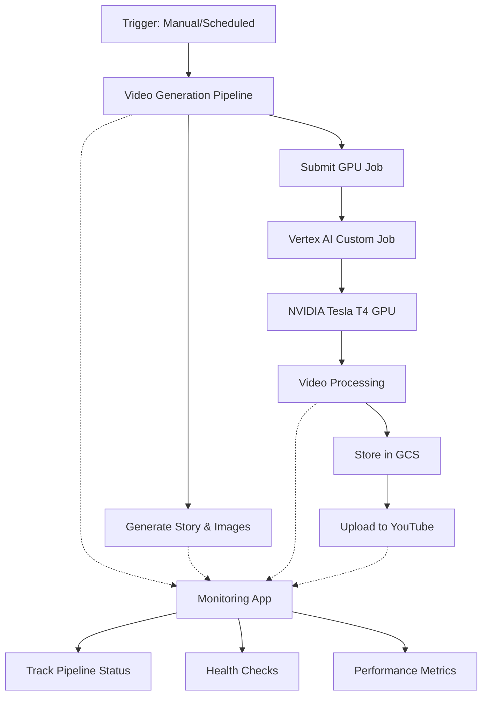

# **AutoVideo v1 — AI Auto Video Generator**

An automated video generation pipeline that creates engaging videos from AI-generated stories, complete with images, voiceovers, and YouTube uploads. Built with a modern microservices architecture featuring on-demand GPU processing and real-time monitoring.

## 🏗️ Architecture Overview

AutoVideo is a **batch processing pipeline** with monitoring capabilities:

### **Core Function**
- 🎬 **Automated Video Generation**: Creates complete videos from AI-generated content
- 📤 **YouTube Upload**: Automatically publishes to YouTube with metadata
- 🔄 **Batch Processing**: Runs on-demand or scheduled to generate videos

### **Monitoring Interface**
- 📊 **Flask Web App**: Provides real-time status and health monitoring
- 🔍 **Pipeline Visibility**: Track generation progress and performance
- 📈 **Metrics Dashboard**: Monitor resource usage and success rates

### **Main Components**

1. **Video Generation Pipeline** (Core)
   - AI story generation and scene extraction
   - Image creation and voiceover synthesis
   - GPU-accelerated video processing
   - Automated YouTube publishing

2. **Monitoring Web App** (`av-app`)
   - Flask-based status and health endpoints
   - Real-time pipeline monitoring
   - Performance metrics and logging
   - Deployed on Google Cloud Run

3. **GPU Processing** (`av-gpu-worker` + Vertex AI)
   - Cloud Run service for basic video tasks
   - Vertex AI Custom Jobs for heavy GPU processing
   - NVIDIA Tesla T4 acceleration
   - Zero idle costs

### **Architecture Benefits**
- 💰 **Cost Efficient**: ~75% cost reduction vs unified GPU deployment
- 🚀 **Fast Scaling**: Independent scaling for monitoring and processing
- 🛡️ **Fault Isolation**: GPU issues don't affect monitoring
- ⚡ **Zero Idle Costs**: GPU resources only used during processing
- 📊 **Full Visibility**: Monitor every step of video generation



## 🎬 Video Generation Pipeline

### **Execution Flow**
1. **Trigger**: Manual execution or scheduled run
2. **Content Creation**: AI generates story, images, and voiceover
3. **GPU Processing**: Heavy video rendering with CUDA acceleration
4. **Publishing**: Automatic upload to YouTube with metadata
5. **Monitoring**: Real-time status updates via web interface

### **Phase 1: Content Creation**
1. **Story Generation** - OpenAI GPT-4 creates engaging narratives
2. **Scene Extraction** - AI identifies key visual moments
3. **Image Generation** - DALL-E creates consistent visuals
4. **Voiceover Generation** - ElevenLabs synthesizes natural speech

### **Phase 2: Video Processing** (GPU Jobs)
5. **GPU Job Submission** - Triggers Vertex AI custom job
6. **CUDA-Accelerated Rendering** - Hardware-accelerated video creation
7. **Advanced Encoding** - Optimized for YouTube delivery
8. **Result Storage** - Secure GCS storage with CDN delivery

### **Phase 3: Distribution**
9. **YouTube Upload** - Automated publishing with metadata
10. **Analytics Tracking** - Performance monitoring and insights

## 🚀 Quick Start

### **Prerequisites**
- Python 3.11+
- Docker & Docker Compose
- Google Cloud SDK
- GitHub account for CI/CD

### **Required API Keys**
- OpenAI API Key (GPT-4 & DALL-E)
- ElevenLabs API Key (Voice synthesis)
- YouTube API Credentials (Video upload)
- Google Cloud Project (Infrastructure)

### **1. Environment Setup**

```bash
# Clone repository
git clone https://github.com/rezearcher/AutoVideo.v1.git
cd AutoVideo.v1

# Create virtual environment
python -m venv .venv
source .venv/bin/activate  # Windows: .venv\Scripts\activate

# Install dependencies
pip install -r requirements.txt

# Configure environment
cp .env.example .env
# Edit .env with your API keys
```

### **2. Google Cloud Setup**

```bash
# Set your project
gcloud config set project YOUR_PROJECT_ID

# Run automated setup
./scripts/setup_gcp.sh
```

This enables all required APIs and configures permissions for:
- ✅ Cloud Run (monitoring web app)
- ✅ Vertex AI (GPU jobs)
- ✅ Cloud Storage (asset management)
- ✅ Container Registry (image storage)
- ✅ Cloud Build (CI/CD)

### **3. Local Development**

```bash
# Run video generation pipeline
python main.py

# Or run with monitoring (Flask app)
python main.py --monitor

# Or with Docker
docker build -t autovideo .
docker run --env-file .env -p 8080:8080 autovideo
```

### **4. GPU Container Setup**

```bash
# Build and deploy GPU container (one-time setup)
./build-gpu-container.sh
```

This creates the NVIDIA CUDA container for Vertex AI jobs.

## 🔄 Deployment & Execution

### **Deployment Strategy**

**Monitoring App**: Deploys automatically on every push to `main`
- Provides real-time status during video generation
- Health checks and performance monitoring
- Always available for pipeline visibility

**GPU Container**: Deploy manually when GPU code changes
```bash
./build-gpu-container.sh
```

### **Execution Methods**

#### **1. Manual Execution**
```bash
# Generate video locally
python main.py

# Trigger via monitoring API
curl -X POST https://av-app-u6sfbxnveq-uc.a.run.app/generate
```

#### **2. Scheduled Execution** (Recommended)
```yaml
# Add to .github/workflows/scheduled-generation.yml
name: Daily Video Generation
on:
  schedule:
    - cron: '0 9 * * *'  # Daily at 9 AM EST
  workflow_dispatch:

jobs:
  generate-video:
    runs-on: ubuntu-latest
    steps:
      - name: Trigger Video Generation
        run: |
          curl -X POST https://av-app-u6sfbxnveq-uc.a.run.app/generate
```

#### **3. Cloud Run Jobs** (Alternative)
```bash
# Deploy as Cloud Run Job for scheduled execution
gcloud run jobs create av-video-generator \
  --image gcr.io/av-8675309/av-app:latest \
  --region us-central1 \
  --task-timeout 3600
```

### **Required GitHub Secrets**

Configure these in your repository settings:

```yaml
# API Keys
OPENAI_API_KEY: Your OpenAI API key
ELEVENLABS_API_KEY: Your ElevenLabs API key
YOUTUBE_CLIENT_ID: YouTube API client ID
YOUTUBE_CLIENT_SECRET: YouTube API client secret
YOUTUBE_PROJECT_ID: YouTube API project ID

# Google Cloud (from setup script)
GOOGLE_CLOUD_PROJECT_ID: Your GCP project ID
GOOGLE_CLOUD_SA_KEY: Service account JSON key
```

## 📊 Monitoring & Observability

### **Real-Time Monitoring**

The Flask monitoring app provides:
- 📈 **Pipeline Status**: Current generation progress
- 🚨 **Health Checks**: System health and API connectivity
- 📊 **Performance Metrics**: Generation times and resource usage
- 🔍 **Detailed Logs**: Step-by-step pipeline execution

### **Monitoring Endpoints**

```http
GET  /health              # System health check
GET  /status              # Current pipeline status
POST /generate            # Trigger video generation
GET  /metrics             # Performance metrics
```

### **Example Monitoring**

```bash
# Check if system is healthy
curl https://av-app-u6sfbxnveq-uc.a.run.app/health

# Monitor generation progress
curl https://av-app-u6sfbxnveq-uc.a.run.app/status

# Trigger new video generation
curl -X POST https://av-app-u6sfbxnveq-uc.a.run.app/generate
```

### **Key Metrics Tracked**

```yaml
Pipeline Metrics:
  - autovideo/pipeline_started
  - autovideo/pipeline_completed  
  - autovideo/pipeline_duration
  - autovideo/phase_duration

Resource Metrics:
  - autovideo/images_generated
  - autovideo/gpu_job_duration
  - autovideo/storage_usage

Health Metrics:
  - autovideo/health_check
  - autovideo/api_response_time
  - autovideo/error_rate
```

## 🛠️ GPU Job Implementation

### **Vertex AI Custom Jobs**

The application uses Vertex AI for on-demand GPU processing:

```python
from vertex_gpu_service import VertexGPUJobService

# Initialize GPU service
gpu_service = VertexGPUJobService(
    project_id="your-project-id",
    region="us-central1"
)

# Submit GPU job (non-blocking)
job_id = gpu_service.submit_gpu_job(
    script=generated_script,
    voice_settings=voice_config,
    video_settings=video_config
)

# Monitor via web interface
# Check status at /status endpoint
```

### **GPU Container Specifications**

- **Base Image**: NVIDIA CUDA 11.8 + Ubuntu 20.04
- **GPU**: NVIDIA Tesla T4 (16GB VRAM)
- **Machine**: n1-standard-4 (4 vCPU, 15GB RAM)
- **Storage**: Google Cloud Storage integration
- **Networking**: Private VPC with secure GCS access

### **Cost Optimization**

| Component | Cost Model | Monthly Estimate |
|-----------|------------|------------------|
| Monitoring App (Cloud Run) | Always-on | ~$20 |
| GPU Worker (Cloud Run) | Auto-scaling | ~$10 |
| Vertex AI GPU Jobs | Pay-per-use | ~$5-15 |
| Storage & Networking | Usage-based | ~$10 |
| **Total** | | **~$45-55** |

*vs. Always-on GPU: ~$250/month*

## 📁 Project Structure

```
AutoVideo.v1/
├── .github/workflows/        # GitHub Actions CI/CD
│   ├── main.yml             # Main app deployment to Cloud Run
│   ├── deploy-vertex-gpu.yml # Vertex AI GPU container deployment
│   ├── scheduled-generation.yml # Daily video generation
│   └── setup-monitoring.yml # Monitoring setup
├── scripts/                 # Utility scripts
│   ├── setup_gcp.sh         # GCP environment setup
│   ├── build-gpu-container.sh # Manual GPU container build
│   └── setup_monitoring.py # Monitoring configuration
├── output/                  # Generated content
│   ├── audio/              # Voice files
│   ├── images/             # Generated images
│   ├── videos/             # Final videos
│   └── logs/               # Application logs
├── gpu_worker.py            # Vertex AI GPU processing script
├── vertex_gpu_service.py    # GPU job management service
├── Dockerfile              # Main app container
├── Dockerfile.gpu          # Vertex AI GPU container
├── requirements.txt        # Main app dependencies
├── requirements-gpu.txt    # GPU worker dependencies
├── main.py                 # Video generation pipeline + monitoring
├── story_generator.py      # AI story generation
├── image_generator.py      # DALL-E image creation
├── voiceover_generator.py  # ElevenLabs voice synthesis
├── video_creator.py        # Local video assembly (fallback)
├── caption_generator.py    # Video caption generation
└── monitoring-config.yaml  # Monitoring configuration
```

## 🔄 Automated Deployment

The entire system is fully automated via GitHub Actions:

### **Continuous Integration/Deployment**

1. **Code Push**: Push to `main` branch triggers deployments
2. **Vertex AI GPU Container**: Auto-builds when GPU-related files change
3. **Main Application**: Deploys to Cloud Run with latest configuration
4. **Scheduled Generation**: Runs daily at 9 AM EST automatically

### **Deployment Triggers**

| Workflow | Trigger Files | Action |
|----------|---------------|---------|
| `main.yml` | Any code changes | Deploy main app to Cloud Run |
| `deploy-vertex-gpu.yml` | `gpu_worker.py`, `Dockerfile.gpu`, `requirements-gpu.txt`, `caption_generator.py`, `vertex_gpu_service.py` | Build & deploy GPU container |
| `scheduled-generation.yml` | Daily cron + manual trigger | Generate and upload video |

### **Zero-Touch Operations**

✅ **Fully Automated**: No manual intervention required  
✅ **Self-Healing**: Fallback to local processing if GPU fails  
✅ **Cost-Optimized**: GPU only runs when needed  
✅ **Monitoring**: Real-time metrics and error reporting  

## 🔧 Development

### **Local Testing**

```bash
# Run video generation pipeline
python main.py

# Run API tests
python test_api.py

# Test GPU container locally (requires NVIDIA Docker)
docker run --gpus all -it gcr.io/av-8675309/av-gpu-job:latest

# Monitor workflows
./scripts/monitor_workflow.sh
```

### **Code Quality**

```bash
# Format code
black .
flake8 .

# Type checking
mypy .

# Run tests
pytest
```

## 🚀 Roadmap

### **V1 (Current)** ✅
- ✅ Automated video generation pipeline
- ✅ GPU-accelerated processing
- ✅ YouTube integration
- ✅ Real-time monitoring interface
- ✅ Cost-optimized architecture

### **V2 (Q2 2025)**
- 🎯 Scheduled daily/weekly generation
- 🎯 Advanced video editing (scene analysis, dynamic pacing)
- 🎯 Multi-platform publishing (TikTok, Instagram)
- 🎯 Trend detection and viral content optimization
- 🎯 Custom voice cloning

### **V3 (Q4 2025)**
- 🎯 Real-time trend scraping
- 🎯 A/B testing for content optimization
- 🎯 Multi-language support
- 🎯 Advanced AI editing with scene transitions
- 🎯 Revenue optimization algorithms

## 🛡️ Security & Best Practices

### **Security Features**
- 🔐 Workload Identity Federation (no service account keys)
- 🔒 Encrypted secrets management
- 🛡️ Private container registry
- 🌐 VPC-native networking
- 📝 Comprehensive audit logging

### **Best Practices**
- ♻️ Immutable infrastructure
- 🔄 Blue-green deployments
- 📊 Comprehensive monitoring
- 🧪 Automated testing
- 💰 Cost optimization

## 🤝 Contributing

1. Fork the repository
2. Create a feature branch (`git checkout -b feature/amazing-feature`)
3. Commit changes (`git commit -m 'Add amazing feature'`)
4. Push to branch (`git push origin feature/amazing-feature`)
5. Open a Pull Request

## 📄 License

This project is licensed under the MIT License - see the [LICENSE](LICENSE) file for details.

---

## ✨ Demo Examples

[](https://www.youtube.com/watch?v=hV4t2yW-RUk)
[](https://www.youtube.com/watch?v=Vzcras5Snyo)

---

## 👨‍💻 Author

**Rez E. Archer**  
DevOps Architect | Full Stack Developer | AI Infrastructure Specialist

- 🌐 [probably.ninja](https://probably.ninja) (coming soon)
- 📧 Contact via GitHub Issues

---

## 🙏 Acknowledgments

- OpenAI for GPT-4 and DALL-E APIs
- ElevenLabs for voice synthesis technology
- Google Cloud for robust infrastructure
- NVIDIA for CUDA GPU acceleration
- The open-source community for foundational tools

---

*Built with ❤️ for creators who want to scale their content production with AI*
