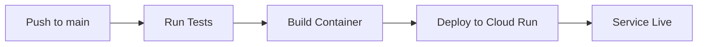
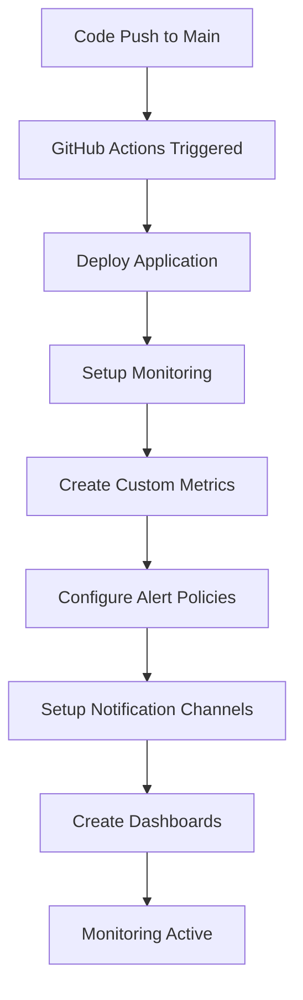

# **AutoVideo v1 — AI Auto Video Generator**

An automated video generation pipeline that creates engaging videos from AI-generated stories, complete with images, voiceovers, and YouTube uploads.

## Architecture

The application consists of two main components:

1. **Main Application (av-app)**
   - Flask-based web service
   - Handles API endpoints and coordination
   - Manages video generation pipeline
   - Deployed on Google Cloud Run

2. **GPU Worker**
   - Dedicated service for video processing
   - Handles computationally intensive tasks
   - Optimized for GPU acceleration
   - Deployed on Google Cloud Run with GPU support

## Pipeline Process

1. **Story Generation**
   - Uses OpenAI to generate engaging stories
   - Extracts key scenes for visualization

2. **Image Generation**
   - Creates images for each scene
   - Ensures visual consistency

3. **Voiceover Generation**
   - Converts story text to natural-sounding speech
   - Uses ElevenLabs for high-quality voice synthesis

4. **Video Creation**
   - Combines images and voiceover
   - Adds transitions and effects
   - Optimizes for YouTube

5. **YouTube Upload**
   - Handles authentication and upload
   - Manages video metadata

## Setup

### Prerequisites

- Python 3.11+
- Docker
- Google Cloud SDK
- Required API keys:
  - OpenAI API Key
  - ElevenLabs API Key
  - YouTube API credentials
  - Google Cloud Project

### Google Cloud Platform Setup

**⚠️ Important: You must enable several GCP APIs and configure permissions before deployment.**

#### Quick Setup (Recommended)

Run the automated setup script:

```bash
# Set your GCP project
gcloud config set project YOUR_PROJECT_ID

# Run the setup script
./scripts/setup_gcp.sh
```

This script will:
- ✅ Enable all required Google Cloud APIs
- ✅ Create a service account with proper permissions
- ✅ Generate authentication keys
- ✅ Verify the setup

#### Manual Setup

If you prefer manual setup, see the detailed guide: [`docs/gcp-setup.md`](docs/gcp-setup.md)

#### Required GCP APIs

The following APIs must be enabled:
- **Cloud Build** (`cloudbuild.googleapis.com`)
- **Cloud Run** (`run.googleapis.com`) 
- **Container Registry** (`containerregistry.googleapis.com`)
- **Cloud Monitoring** (`monitoring.googleapis.com`)
- **Cloud Logging** (`logging.googleapis.com`)
- **Cloud Resource Manager** (`cloudresourcemanager.googleapis.com`)
- **Service Usage** (`serviceusage.googleapis.com`)
- **Identity & Access Management** (`iam.googleapis.com`)

#### Required GitHub Secrets

After running the setup script, add these secrets to your GitHub repository:

| Secret Name | Description |
|-------------|-------------|
| `GOOGLE_CLOUD_PROJECT_ID` | Your GCP Project ID |
| `GOOGLE_CLOUD_SA_KEY` | Service account key (JSON) |
| `OPENAI_API_KEY` | OpenAI API key |
| `ELEVENLABS_API_KEY` | ElevenLabs API key |
| `YOUTUBE_CLIENT_ID` | YouTube API client ID |
| `YOUTUBE_CLIENT_SECRET` | YouTube API client secret |
| `YOUTUBE_PROJECT_ID` | YouTube API project ID |

### Environment Variables

```bash
OPENAI_API_KEY=your_openai_key
ELAI_API_KEY=your_elai_key
DID_API_KEY=your_did_key
IMGUR_CLIENT_ID=your_imgur_client_id
IMGUR_CLIENT_SECRET=your_imgur_client_secret
ELEVENLABS_API_KEY=your_elevenlabs_key
PEXELS_API_KEY=your_pexels_key
YOUTUBE_CLIENT_ID=your_youtube_client_id
YOUTUBE_CLIENT_SECRET=your_youtube_client_secret
YOUTUBE_PROJECT_ID=your_youtube_project_id
GOOGLE_CLOUD_PROJECT=your_gcp_project_id
```

### Local Development

1. Clone the repository:
   ```bash
   git clone https://github.com/rezearcher/AutoVideo.v1.git
   cd AI-Auto-Video-Generator
   ```

2. Create and activate virtual environment:
   ```bash
   python -m venv venv
   source venv/bin/activate  # Linux/Mac
   # or
   .\venv\Scripts\activate  # Windows
   ```

3. Install dependencies:
   ```bash
   pip install -r requirements.txt
   ```

4. Run the application:
   ```bash
   python main.py
   ```

### Docker Build

1. Build the image:
   ```bash
   docker build -t av-app .
   ```

2. Run the container:
   ```bash
   docker run -p 8080:8080 av-app
   ```

## Deployment

### Automated Deployment Process

**🚀 The application automatically deploys when you commit code to the `main` branch.**

The deployment process is fully automated via GitHub Actions and includes:

1. **Trigger**: Any push to the `main` branch
2. **Testing**: Runs API connectivity tests for all services
3. **Build**: Creates Docker container with your latest code
4. **Deploy**: Deploys to Google Cloud Run in production

### Deployment Pipeline



#### Step-by-Step Process:

1. **API Tests** (`test` job)
   - Tests OpenAI API connectivity
   - Tests ElevenLabs API connectivity  
   - Tests YouTube API credentials
   - Must pass for deployment to proceed

2. **Production Deployment** (`deploy-production` job)
   - Builds Docker container with latest code
   - Pushes to Google Container Registry
   - Deploys to Cloud Run with production configuration:
     - **Service**: `av-app`
     - **Region**: `us-central1`
     - **Resources**: 2Gi memory, 2 CPU
     - **Scaling**: 1-10 instances
     - **Timeout**: 300s

### Manual Deployment

If you need to deploy manually (not recommended for production):

```bash
# Using the deployment script
./scripts/deploy.sh

# Or using gcloud directly
gcloud builds submit --tag gcr.io/$GOOGLE_CLOUD_PROJECT/av-app
gcloud run deploy av-app \
  --image gcr.io/$GOOGLE_CLOUD_PROJECT/av-app \
  --platform managed \
  --region us-central1 \
  --allow-unauthenticated
```

### Monitoring Deployments

- **GitHub Actions**: Check the Actions tab in your repository
- **Cloud Run Console**: Monitor service health and logs
- **Health Check**: `GET /health` endpoint for service status

### Deployment Requirements

Before pushing to main, ensure:
- [ ] All API keys are configured in GitHub Secrets
- [ ] Code passes local tests
- [ ] Environment variables are properly set
- [ ] No sensitive data in code (use secrets instead)

### Required GitHub Secrets

The following secrets must be configured in your repository:
- `OPENAI_API_KEY`
- `ELEVENLABS_API_KEY` 
- `YOUTUBE_CLIENT_ID`
- `YOUTUBE_CLIENT_SECRET`
- `YOUTUBE_PROJECT_ID`

## API Endpoints

- `GET /health` - Health check endpoint
- `GET /status` - Get current video generation status
- `POST /generate` - Start video generation process

## Monitoring

The application includes comprehensive logging and timing metrics for each phase of the video generation process. You can monitor the progress through the `/status` endpoint.

## Contributing

1. Fork the repository
2. Create a feature branch
3. Commit your changes
4. Push to the branch
5. Create a Pull Request

## License

This project is licensed under the MIT License - see the LICENSE file for details.

---

# ✨ **Demo Examples**
[](https://www.youtube.com/watch?v=hV4t2yW-RUk)
[](https://www.youtube.com/watch?v=Vzcras5Snyo)

---

# 🚀 **Project Goals (2025 Rollout)**

| Phase | Goal |
|:---|:---|
| V1 | ✅ Generate basic videos, upload to YouTube via automation |
| V2 | Improve video quality (AI scene analysis, dynamic editing) |
| V3 | Inject trend detection to create timely, viral content |
| Beyond | Expand to TikTok, Instagram, trend scraping, analytics |

---

# 📦 **Getting Started**

## 1. Prerequisites

- Python 3.8+ (pyenv recommended)
- Docker + Docker Compose (for containerization)
- GitHub account (for repo + CI/CD)
- Google Cloud / YouTube API credentials
- FFmpeg installed locally (`brew install ffmpeg` or `apt install ffmpeg`)

---

## 2. Environment Setup

```bash
# Clone the repository
git clone https://github.com/YOURNAMEHERE/AutoVideo.git
cd AutoVideo

# Create and activate virtual environment
python -m venv .venv
source .venv/bin/activate  # On Windows: .venv\Scripts\activate

# Install the package in development mode
pip install -e .

# Install development dependencies (optional)
pip install -r requirements-dev.txt

# Install spacy model
python -m spacy download en_core_web_sm
```

---

## 3. Project Structure

```
AI-Auto-Video-Generator/
├── .github/               # GitHub Actions workflows
│   └── workflows/        # CI/CD configuration
├── .venv/                # Virtual environment
├── output/               # Generated videos
│   ├── audio/           # Generated audio files
│   ├── images/          # Generated images
│   ├── logs/            # Application logs
│   ├── text/            # Generated text content
│   └── video/           # Final video output
├── scripts/             # Utility scripts
├── youtube_uploader/    # YouTube upload functionality
├── .env                 # Environment variables (create from .env.example)
├── .env.example        # Example environment variables
├── main.py             # Main entry point
├── story_generator.py  # Story generation using GPT
├── image_generator.py  # Image generation using DALL-E
├── voiceover_generator.py # Voice generation using ElevenLabs
├── video_creator.py    # Video assembly using MoviePy
├── topic_manager.py    # Topic management and generation
├── output_manager.py   # Output file management
├── setup.py           # Package setup configuration
├── requirements.txt   # Core dependencies
└── requirements-dev.txt # Development dependencies
```

---

## 4. API Keys Configuration

Copy `.env.example` to `.env` and fill in your API keys:

```bash
cp .env.example .env
```

Required API keys:
- OpenAI API Key (for story and image generation)
- ElevenLabs API Key (for voice generation)
- YouTube API credentials (for video upload)
- Stability AI API Key (for image generation)

**Important:**  
Keep your API keys secret. Never commit `.env` to GitHub.

---

## 5. Usage

### Local Development

Run the application using the installed command:

```bash
ai-video-gen
```

Or run directly:

```bash
python main.py
```

### Docker

Build and run the container:

```bash
docker build -t autovideo .
docker run --env-file .env autovideo
```

### Cloud Run Deployment

The application is automatically deployed to Google Cloud Run via GitHub Actions. The workflow:

1. Builds the Docker image
2. Pushes to Google Container Registry
3. Deploys to Cloud Run
4. Runs daily at 9 AM EST

To deploy manually:

```bash
gcloud run deploy av-app \
  --image us-central1-docker.pkg.dev/PROJECT_ID/av-app/av-app:latest \
  --region us-central1 \
  --platform managed \
  --allow-unauthenticated
```

The application will:
1. Generate a story from a prompt
2. Create images for key scenes
3. Generate voiceover narration
4. Assemble the final video
5. Upload to YouTube automatically

Output files will be saved in the `/output` directory, organized by type and timestamp.

---

# 🐳 **Containerization**

The application is containerized using Docker and includes:

- Python 3.11 base image
- FFmpeg for video processing
- Gunicorn for production serving
- Health checks and proper logging
- Non-root user for security
- Proper file permissions

# 🔄 **Split Architecture**

The application uses a split architecture with two main components:

1. **Web Application Container**
   - Handles HTTP requests and API endpoints
   - Manages story generation and image creation
   - Coordinates the video generation process
   - Runs on standard Cloud Run instances

2. **GPU Worker Container**
   - Dedicated container for video processing
   - Uses NVIDIA CUDA for hardware acceleration
   - Handles video rendering and encoding
   - Runs on GPU-enabled instances
   - Communicates with main app via HTTP

This architecture provides several benefits:
- Better resource utilization
- Improved scalability
- Independent scaling of web and processing components
- Cost optimization (GPU only when needed)
- Better error isolation

The worker container is built using `Dockerfile.gpu-worker` and includes:
- NVIDIA CUDA runtime
- FFmpeg with CUDA support
- FastAPI for worker API endpoints
- Async processing capabilities

---

# ⚙️ **Development**

## Testing

Run tests with pytest:

```bash
pytest
```

Run tests with coverage:

```bash
pytest --cov=.
```

## Code Quality

Format code:

```bash
black .
flake8
mypy .
```

## Documentation

Build documentation:

```bash
cd docs
make html
```

---

# 🛰️ **Cloud Deployment**

The application is deployed to Google Cloud Run with:

- Daily scheduled execution (9 AM EST)
- Automatic container builds
- Environment variable management
- Health monitoring
- Proper logging
- YouTube integration

Required GCP setup:
1. Enable required APIs (Cloud Run, Container Registry)
2. Create service account with necessary permissions
3. Configure GitHub Actions secrets

## Secret Management

### GitHub Actions Secrets
The application uses GitHub Actions secrets for secure deployment. Required secrets:

```yaml
# GitHub Actions Secrets
OPENAI_API_KEY: OpenAI API key for story generation
ELEVENLABS_API_KEY: ElevenLabs API key for voice synthesis
WIF_PROVIDER: Google Cloud Workload Identity Provider
WIF_SERVICE_ACCOUNT: Google Cloud Service Account for deployment
```

### Cloud Run Environment Variables
The application uses environment variables in Cloud Run for runtime configuration:

```yaml
# Cloud Run Environment Variables
OPENAI_API_KEY: Set from GitHub Actions secret
ELEVENLABS_API_KEY: Set from GitHub Actions secret
YOUTUBE_ENABLED: true/false to control YouTube upload feature
GOOGLE_CLOUD_PROJECT: Project ID for Google Cloud services
```

### Important Notes
1. Never store secrets in files or commit them to the repository
2. Use GitHub Actions secrets for deployment-time configuration
3. Use Cloud Run environment variables for runtime configuration
4. The service account must have the following roles:
   - Cloud Run Admin
   - Service Account User
   - Storage Admin

---

# 📈 **Future Enhancements (V2+)**

- Smarter video editing (scene analysis, pacing control)
- Auto-generated thumbnails
- Trend scraping (TikTok, YouTube, Instagram)
- Dynamic title/caption/hashtag injection
- Full multi-platform publishing
- Analytics tracking and performance dashboards

---

# 🧠 **Notes and Warnings**

- AI generation can sometimes fail due to API limits or bad prompts — retries will be implemented.
- This project will evolve rapidly — check for updated branches.
- This repo **starts simple on purpose** — foundation first, fancy later.

---

# 🛠️ **Contributing**

Right now this is a **personal/internal project**.  
Future contributors will follow a simple fork + pull request model.

---

# 👨‍💻 **Author**

**Rez E. Archer**  
- DevOps Architect | Full Stack Developer | Builder of Silent Empires  
- [probably.ninja (coming soon)](#)

---

# 🏴 **License**

MIT License (free to use, modify, distribute — with attribution if public.)

---

# Testing GitHub Actions
# Force deployment

## 📊 Google Cloud Monitoring

AutoVideo includes comprehensive Google Cloud monitoring with real-time metrics, alerting, and observability features.

### Monitoring Features

#### 🔍 **Custom Metrics**
- **Pipeline Tracking**: Monitor video generation pipeline start, completion, and duration
- **Phase Monitoring**: Track individual phases (story generation, image creation, voiceover, video processing)
- **Resource Metrics**: Monitor image generation count, prompt extraction, and processing times
- **Health Checks**: Continuous health monitoring with status reporting

#### 🚨 **Alerting Policies**
- **High Error Rate**: Alerts when error rate exceeds 5%
- **Pipeline Failures**: Notifications for pipeline failure rate > 10%
- **Long Pipeline Duration**: Alerts for pipelines taking > 30 minutes
- **Service Health**: Immediate alerts for service downtime
- **Resource Usage**: CPU and memory utilization alerts at 80% threshold

#### 📈 **Dashboards**
- **Operations Dashboard**: Real-time view of pipeline performance
- **Error Tracking**: Comprehensive error rate and failure analysis
- **Resource Monitoring**: CPU, memory, and instance count tracking
- **Performance Metrics**: Request volume and response time analysis

#### 📧 **Notification Channels**
- **Email Alerts**: Configurable email notifications
- **Slack Integration**: Real-time Slack notifications (optional)
- **Custom Webhooks**: Support for custom notification endpoints

### Automatic Monitoring Setup

Monitoring is automatically configured during deployment:



### Manual Monitoring Setup

To manually set up or update monitoring:

1. **Configure Project ID**:
   ```bash
   export PROJECT_ID="your-gcp-project-id"
   ```

2. **Install Dependencies**:
   ```bash
   pip install google-cloud-monitoring google-cloud-logging google-cloud-error-reporting pyyaml
   ```

3. **Run Setup Script**:
   ```bash
   python scripts/setup_monitoring.py --project-id $PROJECT_ID
   ```

4. **Trigger via GitHub Actions**:
   - Go to Actions tab in GitHub
   - Select "Setup Google Cloud Monitoring"
   - Click "Run workflow"

### Monitoring Configuration

The monitoring setup is defined in `monitoring-config.yaml`:

```yaml
# Key monitoring thresholds
alerting_policies:
  - Error rate threshold: 5%
  - Pipeline failure threshold: 10%
  - Pipeline duration threshold: 30 minutes
  - CPU utilization threshold: 80%
  - Memory utilization threshold: 80%

# Custom metrics tracked
custom_metrics:
  - autovideo/pipeline_started
  - autovideo/pipeline_completed
  - autovideo/pipeline_duration
  - autovideo/phase_duration
  - autovideo/generation_request
  - autovideo/images_generated
  - autovideo/health_check
```

### Accessing Monitoring Data

#### **Google Cloud Console**
1. Navigate to [Google Cloud Monitoring](https://console.cloud.google.com/monitoring)
2. View the "AutoVideo Operations Dashboard"
3. Check alert policies and notification channels
4. Review custom metrics and logs

#### **Programmatic Access**
```python
from google.cloud import monitoring_v3

client = monitoring_v3.MetricServiceClient()
project_name = f"projects/{project_id}"

# List custom metrics
metrics = client.list_metric_descriptors(name=project_name)
for metric in metrics:
    if "autovideo" in metric.type:
        print(f"Metric: {metric.type}")
```

### Key Metrics Explained

| Metric | Description | Alert Threshold |
|--------|-------------|-----------------|
| `pipeline_duration` | Total time for video generation | > 30 minutes |
| `pipeline_completed` | Pipeline success/failure status | > 10% failure rate |
| `phase_duration` | Individual phase timing | Tracked for optimization |
| `generation_request` | Incoming generation requests | Rate monitoring |
| `health_check` | Service health status | Any unhealthy status |
| `images_generated` | Images created per pipeline | Performance tracking |

### Troubleshooting Monitoring

#### **Common Issues**

1. **Missing Metrics**:
   ```bash
   # Check if custom metrics are created
   gcloud logging metrics list | grep autovideo
   ```

2. **Alert Policy Errors**:
   ```bash
   # List alert policies
   gcloud alpha monitoring policies list --filter="displayName:AutoVideo"
   ```

3. **Permission Issues**:
   - Ensure service account has `Monitoring Admin` role
   - Verify `GOOGLE_CLOUD_SA_KEY` secret is configured

#### **Monitoring Health Check**
```bash
# Test monitoring endpoint
curl https://your-app-url.run.app/health

# Expected response
{
  "status": "healthy",
  "timestamp": "2024-01-15T10:30:00Z",
  "monitoring": "active"
}
```

### SLO (Service Level Objectives)

AutoVideo maintains the following SLOs:

- **Availability**: 99.5% uptime (30-day rolling window)
- **Pipeline Success Rate**: 95% (7-day rolling window)
- **Response Time**: < 5 seconds for API endpoints
- **Error Rate**: < 5% for all requests

### Monitoring Best Practices

1. **Regular Review**: Check dashboards weekly for performance trends
2. **Alert Tuning**: Adjust thresholds based on actual usage patterns
3. **Log Analysis**: Use structured logging for better debugging
4. **Capacity Planning**: Monitor resource usage for scaling decisions
5. **Incident Response**: Set up escalation procedures for critical alerts

### Future Monitoring Enhancements

- **Custom Dashboards**: Application-specific monitoring views
- **Predictive Alerting**: ML-based anomaly detection
- **Cost Monitoring**: Track GCP resource costs and optimization
- **User Experience Monitoring**: End-to-end user journey tracking
- **Integration Monitoring**: Third-party API performance tracking
