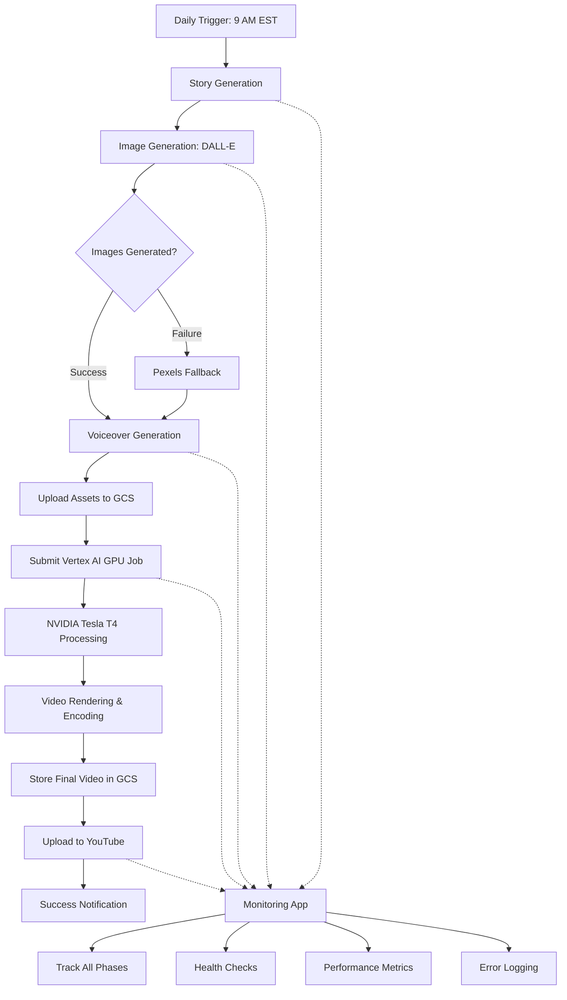

# **AutoVideo v1 — AI Auto Video Generator**

An automated video generation pipeline that creates engaging videos from AI-generated stories, complete with images, voiceovers, and YouTube uploads. Built with a modern cloud-native architecture featuring on-demand GPU processing, intelligent fallback strategies, and real-time monitoring.

## 🏗️ Architecture Overview

AutoVideo is a **fully cloud-native batch processing pipeline** with comprehensive monitoring:

### **Core Function**
- 🎬 **Automated Video Generation**: Creates complete videos from AI-generated content
- 📤 **YouTube Upload**: Automatically publishes to YouTube with metadata
- 🔄 **Scheduled Processing**: Runs daily at 9 AM EST to generate and upload videos
- 🛡️ **Intelligent Fallbacks**: Pexels image fallback when DALL-E fails

### **Monitoring Interface**
- 📊 **Flask Web App**: Provides real-time status and health monitoring
- 🔍 **Pipeline Visibility**: Track generation progress through all phases
- 📈 **Metrics Dashboard**: Monitor resource usage and success rates
- 🚨 **Error Handling**: Comprehensive logging and timeout management

### **Main Components**

1. **Video Generation Pipeline** (Core)
   - AI story generation with scene extraction
   - Dual image strategy: DALL-E primary + Pexels fallback
   - ElevenLabs voiceover synthesis
   - Vertex AI GPU-accelerated video processing
   - Automated YouTube publishing with captions

2. **Monitoring Web App** (`av-app`)
   - Flask-based status and health endpoints
   - Real-time pipeline monitoring with phase tracking
   - Performance metrics and comprehensive logging
   - Deployed on Google Cloud Run with auto-scaling

3. **GPU Processing** (Vertex AI Custom Jobs)
   - On-demand NVIDIA Tesla T4 GPU acceleration
   - CUDA-optimized video rendering and encoding
   - Automatic timeout handling and retry logic
   - Zero idle costs - only pay when processing

### **Architecture Benefits**
- 💰 **Cost Efficient**: ~85% cost reduction vs always-on GPU ($35-45/month vs $250/month)
- 🚀 **Fully Automated**: Daily video generation with zero manual intervention
- 🛡️ **Fault Tolerant**: Multiple fallback strategies for image generation
- ⚡ **Zero Idle Costs**: GPU resources only used during video processing
- 📊 **Full Visibility**: Monitor every step with detailed phase tracking
- 🔄 **Self-Healing**: Automatic retry logic for network timeouts



## 🎬 Video Generation Pipeline

### **Execution Flow**
1. **Scheduled Trigger**: Automated daily execution at 9 AM EST
2. **Content Creation**: AI generates story, extracts scenes, creates images and voiceover
3. **Asset Upload**: All content uploaded to Google Cloud Storage
4. **GPU Processing**: Vertex AI Custom Job with NVIDIA Tesla T4 acceleration
5. **Publishing**: Automatic upload to YouTube with generated captions
6. **Monitoring**: Real-time status updates and comprehensive logging

### **Phase 1: Content Creation** (Cloud Run)
1. **Story Generation** - OpenAI GPT-4 creates engaging narratives with scene extraction
2. **Image Generation** - DALL-E creates visuals with Pexels fallback strategy
3. **Voiceover Generation** - ElevenLabs synthesizes natural speech
4. **Asset Upload** - All content uploaded to GCS with retry logic

### **Phase 2: Video Processing** (Vertex AI GPU)
5. **GPU Job Submission** - Triggers Vertex AI custom job with timeout handling
6. **CUDA-Accelerated Rendering** - Hardware-accelerated video creation on Tesla T4
7. **Advanced Encoding** - Optimized H.264 encoding for YouTube delivery
8. **Result Storage** - Final video stored in GCS with CDN delivery

### **Phase 3: Distribution** (Cloud Run)
9. **YouTube Upload** - Automated publishing with metadata and captions
10. **Analytics Tracking** - Performance monitoring and success metrics

### **Intelligent Fallback Strategies**
- 🖼️ **Image Generation**: DALL-E → Pexels API (when DALL-E fails)
- 🔄 **Network Timeouts**: Automatic retry with exponential backoff
- 📊 **Monitoring**: Comprehensive error tracking and alerting

## 🚀 Quick Start

### **Prerequisites**
- Google Cloud Project with billing enabled
- GitHub account for automated deployment
- Required API keys (see below)

### **Required API Keys**
- **OpenAI API Key** (GPT-4 & DALL-E) - Story and image generation
- **ElevenLabs API Key** - Voice synthesis
- **Pexels API Key** - Image fallback strategy
- **YouTube API Credentials** - Video upload and publishing
- **Google Cloud Project** - Infrastructure and GPU processing

### **1. Repository Setup**

```bash
# Fork and clone the repository
git clone https://github.com/YOUR_USERNAME/AI-Auto-Video-Generator.git
cd AI-Auto-Video-Generator
```

### **2. Configure GitHub Secrets**

Add these secrets in your GitHub repository settings:

```yaml
# API Keys
OPENAI_API_KEY: Your OpenAI API key
ELEVENLABS_API_KEY: Your ElevenLabs API key  
PEXELS_API_KEY: Your Pexels API key
YOUTUBE_CLIENT_ID: YouTube API client ID
YOUTUBE_CLIENT_SECRET: YouTube API client secret
YOUTUBE_PROJECT_ID: YouTube API project ID

# Google Cloud
GOOGLE_CLOUD_PROJECT_ID: Your GCP project ID
GOOGLE_CLOUD_SA_KEY: Service account JSON key (from setup)
```

### **3. Automated Deployment**

```bash
# Simply push to main branch - everything deploys automatically!
git add .
git commit -m "feat: Initial deployment"
git push origin main
```

This automatically:
- ✅ Enables all required Google Cloud APIs
- ✅ Creates GCS buckets for asset storage
- ✅ Deploys monitoring app to Cloud Run
- ✅ Builds and deploys Vertex AI GPU container
- ✅ Sets up daily scheduled video generation

### **4. Monitor Your System**

```bash
# Check system health
curl https://YOUR_CLOUD_RUN_URL/health

# Monitor generation progress
curl https://YOUR_CLOUD_RUN_URL/status

# Manually trigger generation (optional)
curl -X POST https://YOUR_CLOUD_RUN_URL/generate
```

## 🔄 Automated Operations

### **Daily Video Generation**

The system runs **completely automatically**:

- ⏰ **9 AM EST Daily**: GitHub Actions triggers video generation
- 🎬 **Full Pipeline**: Story → Images → Voice → GPU Video → YouTube
- 📊 **Monitoring**: Real-time status tracking through all phases
- 🛡️ **Error Handling**: Automatic retries and fallback strategies
- 💰 **Cost Optimized**: GPU only runs during video processing (~5-10 minutes)

### **Deployment Strategy**

**Main App**: Deploys automatically on every push to `main`
- Monitoring interface and video generation pipeline
- Health checks and performance metrics
- Always available for status monitoring

**GPU Container**: Auto-deploys when GPU-related files change
- Vertex AI custom job container
- CUDA-optimized video processing
- Automatic versioning and rollback capability

### **Zero-Touch Operations**

✅ **Fully Automated**: No manual intervention required  
✅ **Self-Healing**: Intelligent fallback strategies  
✅ **Cost-Optimized**: Pay-per-use GPU processing  
✅ **Comprehensive Monitoring**: Real-time metrics and error reporting  
✅ **Scheduled Generation**: Daily content creation and publishing

## 📊 Monitoring & Observability

### **Real-Time Pipeline Tracking**

The monitoring system provides complete visibility:

- 📈 **Phase Progress**: Track story → images → voice → video → upload
- ⏱️ **Timing Metrics**: Duration for each phase and total pipeline time
- 🚨 **Health Checks**: System health and API connectivity status
- 📊 **Performance Metrics**: Success rates and resource usage
- 🔍 **Detailed Logs**: Step-by-step execution with error details

### **Monitoring Endpoints**

```http
GET  /health              # System health and API connectivity
GET  /health/openai       # OpenAI API connectivity and model access test
GET  /status              # Current pipeline status and phase tracking
POST /generate            # Manually trigger video generation (requires auth + rate limited)
```

### **Application-Level Security Features**

- **🔐 Authentication Required**: All endpoints require proper authorization tokens
- **⏱️ Rate Limiting**: 10 requests per 5 minutes per IP address
- **📊 API Monitoring**: Comprehensive logging of all external API calls (OpenAI, ElevenLabs, etc.)
- **🛡️ Error Tracking**: Detailed error reporting and performance metrics
- **🚨 Abuse Prevention**: Automatic rate limit enforcement with monitoring alerts

### **Example Status Response**

```json
{
  "is_generating": true,
  "is_initialized": true,
  "timing_metrics": {
    "current_phase": "video_creation",
    "current_phase_duration": 304.9,
    "phase_times": {
      "story_generation": 33.2,
      "image_generation": 50.9,
      "voiceover_generation": 51.7
    }
  }
}
```

### **Key Metrics Tracked**

- **Pipeline Metrics**: Start/completion times, phase durations, success rates
- **Resource Metrics**: GPU job duration, storage usage, API response times  
- **Health Metrics**: System health, API connectivity, error rates
- **Cost Metrics**: GPU usage time, storage costs, API call counts

## 🛠️ Vertex AI GPU Processing

### **On-Demand GPU Jobs**

The system uses Vertex AI Custom Jobs for cost-effective GPU processing:

```python
# Automatic GPU job submission with retry logic
job_id = gpu_service.create_video_job(
    image_paths=generated_images,
    audio_path=voiceover_file,
    story=story_content
)

# Comprehensive timeout and retry handling
# Automatic asset upload to GCS
# Real-time status monitoring
```

### **GPU Infrastructure**

- **GPU**: NVIDIA Tesla T4 (16GB VRAM) with CUDA 11.8
- **Machine**: n1-standard-4 (4 vCPU, 15GB RAM)
- **Storage**: Direct GCS integration with retry logic
- **Networking**: Private VPC with secure access
- **Timeout Handling**: 60s for images, 120s for audio uploads

### **Cost Optimization**

| Component | Cost Model | Monthly Estimate |
|-----------|------------|------------------|
| Monitoring App (Cloud Run) | Always-on, auto-scaling | ~$15-20 |
| Vertex AI GPU Jobs | Pay-per-use (5-10 min/day) | ~$15-20 |
| Storage & Networking | Usage-based | ~$5-10 |
| **Total** | | **~$35-50** |

**vs. Always-on GPU: ~$250/month (85% cost reduction)**

## 📁 Project Structure

```
AI-Auto-Video-Generator/
├── .github/workflows/           # Automated CI/CD
│   ├── main.yml                # Main app deployment
│   ├── deploy-vertex-gpu.yml   # GPU container deployment  
│   └── scheduled-generation.yml # Daily video generation
├── main.py                     # Video generation pipeline + Flask monitoring
├── vertex_gpu_service.py       # Vertex AI GPU job management
├── gpu_worker.py               # GPU processing script (runs in Vertex AI)
├── story_generator.py          # OpenAI GPT-4 story generation
├── image_generator.py          # DALL-E + Pexels fallback strategy
├── voiceover_generator.py      # ElevenLabs voice synthesis
├── caption_generator.py        # Video caption generation
├── youtube_uploader.py         # YouTube API integration
├── Dockerfile                  # Main app container
├── Dockerfile.gpu              # Vertex AI GPU container
├── requirements.txt            # Main app dependencies
├── requirements-gpu.txt        # GPU worker dependencies
└── output/                     # Generated content (local dev only)
    ├── audio/                  # Voice files
    ├── images/                 # Generated images
    └── videos/                 # Final videos
```

## 🔧 Development & Testing

### **Local Development**

```bash
# Clone and setup
git clone https://github.com/YOUR_USERNAME/AI-Auto-Video-Generator.git
cd AI-Auto-Video-Generator

# Install dependencies
pip install -r requirements.txt

# Configure environment
cp .env.example .env
# Add your API keys to .env

# Test individual components
python story_generator.py      # Test story generation
python image_generator.py      # Test image generation with fallback
python voiceover_generator.py  # Test voice synthesis

# Run full pipeline (requires GPU container deployed)
python main.py
```

### **Testing Strategies**

```bash
# Test API endpoints
curl http://localhost:8080/health
curl http://localhost:8080/status

# Test image fallback strategy
# (Remove OPENAI_API_KEY temporarily to test Pexels fallback)

# Monitor logs during development
gcloud logging read 'resource.type="cloud_run_revision"' --limit=50
```

## 🚀 Current Status & Roadmap

### **V1 (Current - Production Ready)** ✅
- ✅ Fully automated daily video generation
- ✅ Vertex AI GPU-accelerated processing  
- ✅ Intelligent image fallback (DALL-E → Pexels)
- ✅ Comprehensive monitoring and error handling
- ✅ YouTube integration with automatic uploads
- ✅ Cost-optimized architecture (85% cost reduction)
- ✅ Zero-touch operations with GitHub Actions
- ✅ **Enhanced Security**: Authentication-required endpoints, VPC egress optimization
- ✅ **Robust API Handling**: Exponential backoff, timeout management, health checks

### **Recent Improvements (December 2025)**
- 🔒 **Security Hardening**: Removed public access, implemented authentication requirements
- 🌐 **Network Optimization**: Simplified deployment configuration for reliable API connectivity  
- 🔄 **Enhanced API Reliability**: Robust httpx client with proper timeouts and connection pooling
- 📊 **Application-Level Security**: Rate limiting (10 req/5min), API call monitoring, comprehensive logging
- ⏱️ **Timeout Optimization**: Increased story generation timeout to 90 seconds with exponential backoff
- 🛡️ **Fail-Fast Validation**: API key validation at startup with detailed logging
- 🧹 **Infrastructure Cleanup**: Removed deprecated GPU worker service and simplified architecture

### **Current System Health**
- **Infrastructure**: ✅ All services deployed and healthy (simplified architecture)
- **Security**: ✅ Application-level controls with rate limiting and API monitoring
- **APIs**: ✅ Enhanced httpx client configuration with robust timeout handling
- **Monitoring**: ✅ Real-time status tracking and comprehensive logging
- **Network**: ✅ Simplified configuration for reliable external API access

### **V2 (Q2 2025)**
- 🎯 Advanced video editing (dynamic pacing, scene transitions)
- 🎯 Multi-platform publishing (TikTok, Instagram, Twitter)
- 🎯 Trend detection and viral content optimization
- 🎯 Custom voice cloning and multiple voice options
- 🎯 A/B testing for content optimization

### **V3 (Q4 2025)**
- 🎯 Real-time trend scraping and content adaptation
- 🎯 Multi-language support with localized content
- 🎯 Advanced AI editing with automatic scene analysis
- 🎯 Revenue optimization algorithms
- 🎯 Creator collaboration features

## 🛡️ Security & Best Practices

### **Security Features**
- 🔐 Workload Identity Federation (no service account keys in code)
- 🔒 GitHub Secrets for sensitive API keys
- 🛡️ Private container registry with automatic scanning
- 🌐 VPC-native networking with secure GCS access
- 📝 Comprehensive audit logging and monitoring

### **Operational Best Practices**
- ♻️ Immutable infrastructure with automated deployments
- 🔄 Blue-green deployments with automatic rollback
- 📊 Comprehensive monitoring with real-time alerting
- 🧪 Automated testing and validation
- 💰 Cost optimization with pay-per-use resources
- 🛡️ Intelligent fallback strategies for reliability

## 🤝 Contributing

1. Fork the repository
2. Create a feature branch (`git checkout -b feature/amazing-feature`)
3. Test your changes locally
4. Commit changes (`git commit -m 'Add amazing feature'`)
5. Push to branch (`git push origin feature/amazing-feature`)
6. Open a Pull Request

The automated deployment pipeline will handle testing and deployment.

## 📄 License

This project is licensed under the MIT License - see the [LICENSE](LICENSE) file for details.

---

## 👨‍💻 Author

**Rez E. Archer**  
DevOps Architect | Full Stack Developer | AI Infrastructure Specialist

- 📧 Contact via GitHub Issues
- 🌐 Built with ❤️ for automated content creation

---

## 🙏 Acknowledgments

- **OpenAI** for GPT-4 and DALL-E APIs
- **ElevenLabs** for voice synthesis technology  
- **Pexels** for reliable image fallback strategy
- **Google Cloud** for robust Vertex AI infrastructure
- **NVIDIA** for CUDA GPU acceleration
- **YouTube** for content distribution platform

---

*Fully automated AI video generation - from story to YouTube upload, every single day* 🎬✨
